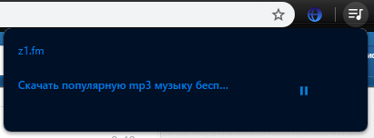
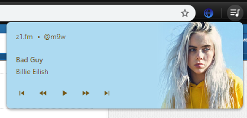

# GlobalMediaControl_.fm
Support Z1.fm in global media control on base TamperMonkey

Before:

After:

# How install:
Install TamperMonkey

https://chrome.google.com/webstore/detail/tampermonkey/dhdgffkkebhmkfjojejmpbldmpobfkfo

Install script

https://github.com/m9w/GMC_z1.fm/raw/master/gmc_z1fm.user.js
